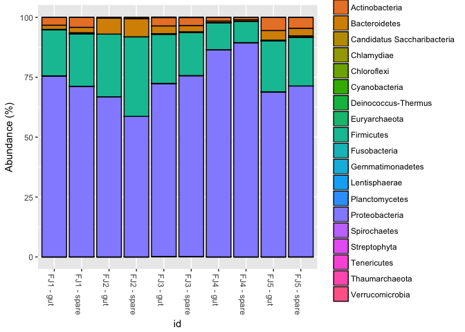
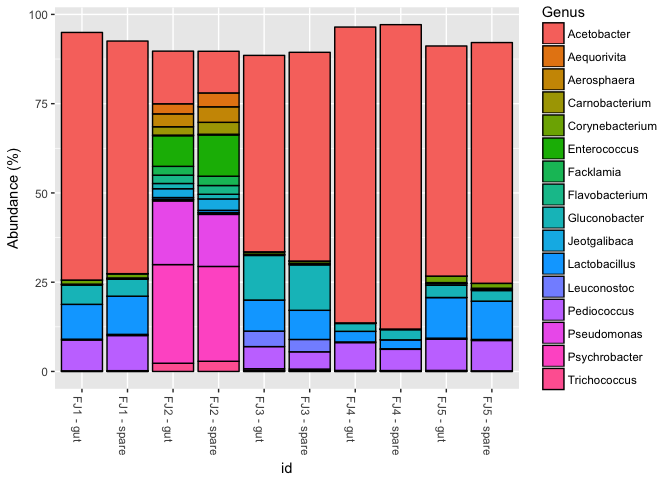
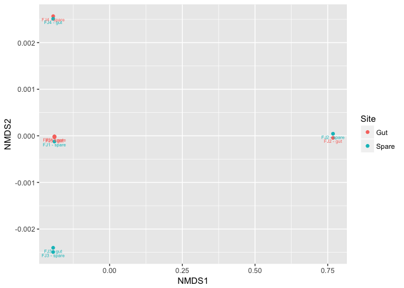

Phyloseqify the Fratjuice Samples
================
Richard Sprague
2018-01-10

Load the prerequisites. This code block could be eliminated if these were included in an environment file.

``` r
#library(phyloseq)
#library(actino)
#library(tidyverse)

# ugly hack to avoid modifying existing project structure
SAMPLEPATH <- "../samples/ubiome/ubiome-processed-outputs"
```

Read the mapping data into a more familiar "Actino-style" mapfile. \[See the crappy documentation for the [Actino package](https://github.com/richardsprague/actino)\].

``` r
results <- readxl::read_excel(file.path(SAMPLEPATH, "/results.xlsx"))
kits <- read.delim(file.path(SAMPLEPATH,"../kits.tsv"))
samples <- read.delim(file.path(SAMPLEPATH,"../../samples.tsv"))


# not quite working: want to add other 'samples' metadata (eg. "Geo" field) to the mapfile
# results[match(results$SeqID,kits$seq_id),]
# paste(samples$fraternity,samples$location)
# match(kits$sample_id,samples$sample_id)]

mapping_df <- data.frame(SSR=results$SeqID, id=results$Sample_ID, Site = kits$tube)
```

Save it as an Excel file to be later readable by the actino functions. You only have to run this chunk once. It's commented now because I already created the map file.

``` r
#library(xlsx)
#xlsx::write.xlsx(mapping_df, file = file.path(SAMPLEPATH,"/json/frat_map_file.xlsx"), row.names = FALSE)
```

Now create the Phyloseq object

``` r
sample_files<-actino::just_json_files_in(file.path(SAMPLEPATH,"/json"))

frat_map_file <- paste0(SAMPLEPATH,"/json/frat_map_file.xlsx")
fratjuice.phylum <- actino::phyloseq_from_JSON_at_rank(sample_files, frat_map_file, rank = "phylum", count.normalized = TRUE)
fratjuice.family <- actino::phyloseq_from_JSON_at_rank(sample_files, frat_map_file, rank = "family", count.normalized = TRUE)
phyloseq::sample_data(fratjuice.family)$id <- mapping_df$id

fratjuice.genus <- actino::phyloseq_from_JSON_at_rank(sample_files, frat_map_file, rank = "genus", count.normalized = TRUE)
phyloseq::sample_data(fratjuice.genus)$id <- mapping_df$id
fratjuice.species <- actino::phyloseq_from_JSON_at_rank(sample_files, frat_map_file, rank = "species", count.normalized = TRUE)
phyloseq::sample_data(fratjuice.genus)$id <- mapping_df$id

phyloseq::sample_data(fratjuice.phylum)
```

    ##           SSR  Site
    ## 300909 300909   Gut
    ## 300921 300921 Spare
    ## 300945 300945   Gut
    ## 300948 300948 Spare
    ## 300960 300960   Gut
    ## 300975 300975 Spare
    ## 300987 300987   Gut
    ## 301026 301026 Spare
    ## 301029 301029   Gut
    ## 301032 301032 Spare

plot the Phylum level

``` r
phyloseq::sample_data(fratjuice.phylum)$id <- mapping_df$id
phyloseq::plot_bar(fratjuice.phylum, fill = "Phylum", x = "id") + 
  ggplot2::scale_y_continuous(labels=function(x)x/10000) + ggplot2::ylab("Abundance (%)")
```



There are 537 unique genus-level taxa found in these samples, so showing all of them would take up too much space. Let's just plot the most common ones:

``` r
frat.topgenus <- phyloseq::prune_taxa(phyloseq::taxa_sums(fratjuice.genus)>50000, fratjuice.genus)
phyloseq::plot_bar(frat.topgenus, fill = "Genus", x = "id") + 
  ggplot2::scale_y_continuous(labels=function(x)x/10000) + ggplot2::ylab("Abundance (%)")
```



Now let's draw a simple PCA/NMDS chart to see if we can spot some clusters:

``` r
ord <- phyloseq::ordinate(fratjuice.family, "NMDS")
```

    ## Square root transformation
    ## Wisconsin double standardization
    ## Run 0 stress 9.897144e-05 
    ## Run 1 stress 9.936825e-05 
    ## ... Procrustes: rmse 0.03835849  max resid 0.04951335 
    ## Run 2 stress 9.240109e-05 
    ## ... New best solution
    ## ... Procrustes: rmse 0.04897754  max resid 0.0639081 
    ## Run 3 stress 9.421215e-05 
    ## ... Procrustes: rmse 0.01721884  max resid 0.02208986 
    ## Run 4 stress 9.733709e-05 
    ## ... Procrustes: rmse 0.05254761  max resid 0.06428371 
    ## Run 5 stress 9.931401e-05 
    ## ... Procrustes: rmse 0.04855673  max resid 0.05975332 
    ## Run 6 stress 9.584158e-05 
    ## ... Procrustes: rmse 0.05035481  max resid 0.06180475 
    ## Run 7 stress 9.723644e-05 
    ## ... Procrustes: rmse 0.01636405  max resid 0.02194445 
    ## Run 8 stress 6.101871e-05 
    ## ... New best solution
    ## ... Procrustes: rmse 0.01442206  max resid 0.01917349 
    ## Run 9 stress 8.712659e-05 
    ## ... Procrustes: rmse 0.01079995  max resid 0.01422448 
    ## Run 10 stress 9.3057e-05 
    ## ... Procrustes: rmse 0.0104247  max resid 0.01377592 
    ## Run 11 stress 9.42971e-05 
    ## ... Procrustes: rmse 0.001984369  max resid 0.002877723 
    ## ... Similar to previous best
    ## Run 12 stress 9.99043e-05 
    ## ... Procrustes: rmse 0.02943381  max resid 0.03793112 
    ## Run 13 stress 9.637662e-05 
    ## ... Procrustes: rmse 0.1039431  max resid 0.1190198 
    ## Run 14 stress 9.715279e-05 
    ## ... Procrustes: rmse 0.002048236  max resid 0.002681303 
    ## ... Similar to previous best
    ## Run 15 stress 9.598694e-05 
    ## ... Procrustes: rmse 0.099477  max resid 0.1149459 
    ## Run 16 stress 9.68307e-05 
    ## ... Procrustes: rmse 0.05834095  max resid 0.07235592 
    ## Run 17 stress 9.616075e-05 
    ## ... Procrustes: rmse 0.01440319  max resid 0.01889095 
    ## Run 18 stress 9.803052e-05 
    ## ... Procrustes: rmse 0.00165279  max resid 0.002440568 
    ## ... Similar to previous best
    ## Run 19 stress 7.137847e-05 
    ## ... Procrustes: rmse 0.002057126  max resid 0.002713684 
    ## ... Similar to previous best
    ## Run 20 stress 9.9479e-05 
    ## ... Procrustes: rmse 0.05519285  max resid 0.06877069 
    ## *** Solution reached

    ## Warning in metaMDS(veganifyOTU(physeq), distance, ...): Stress is (nearly)
    ## zero - you may have insufficient data

``` r
phyloseq::plot_ordination(fratjuice.family, ord, label = "id", color = "Site")
```

    ## Warning: Ignoring unknown aesthetics: na.rm


