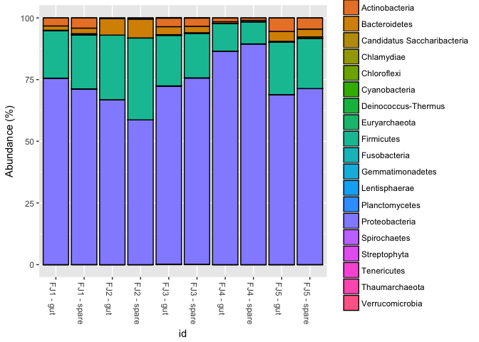
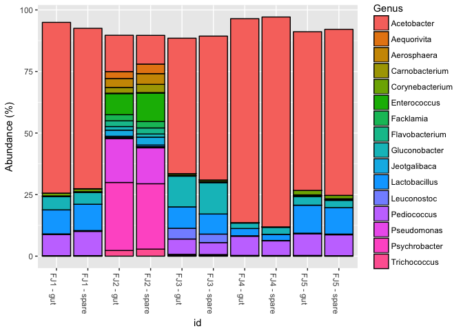

Phyloseqify the Fratjuice samples
================
Richard Sprague
1/5/2018

Load the prerequisites:

``` r
library(phyloseq)
library(actino)
library(tidyverse)
```

    ## ── Attaching packages ───────────────────────────────────────────────────────────── tidyverse 1.2.1 ──

    ## ✔ ggplot2 2.2.1     ✔ purrr   0.2.4
    ## ✔ tibble  1.3.4     ✔ dplyr   0.7.4
    ## ✔ tidyr   0.7.2     ✔ stringr 1.2.0
    ## ✔ readr   1.1.1     ✔ forcats 0.2.0

    ## ── Conflicts ──────────────────────────────────────────────────────────────── tidyverse_conflicts() ──
    ## ✖ dplyr::filter() masks stats::filter()
    ## ✖ dplyr::lag()    masks stats::lag()

``` r
SAMPLEDIR <- "../samples/ubiome/ubiome-processed-outputs"
```

Read the mapping data into a more familiar "Actino-style" mapfile

``` r
results <- readxl::read_excel(paste0(SAMPLEDIR,"/results.xlsx"))
ssrs <- results$SeqID
username <- results$Sample_ID
mapping <- data.frame(SSR=ssrs,id=username)
```

Save it as an Excel file to be later readable by the actino functions. You only have to run this chunk once. It's commented now because I already created the map file.

``` r
#library(xlsx)
#xlsx::write.xlsx(mapping, file = paste0(SAMPLEDIR,"/json/fratmap.xlsx"), row.names = FALSE)
```

Now create the Phyloseq object

``` r
sampleFiles<-actino::just_json_files_in(paste0(SAMPLEDIR,"/json"))
fratMap <- paste0(SAMPLEDIR,"/json/fratmap.xlsx")
fratjuice.phylum <- actino::phyloseq_from_JSON_at_rank(sampleFiles,fratMap,rank = "phylum", count.normalized = TRUE)
fratjuice.genus <- actino::phyloseq_from_JSON_at_rank(sampleFiles,fratMap,rank = "genus", count.normalized = TRUE)
sample_data(fratjuice.genus)$id <- mapping$id
fratjuice.species <- actino::phyloseq_from_JSON_at_rank(sampleFiles,fratMap,rank = "species", count.normalized = TRUE)
sample_data(fratjuice.genus)$id <- mapping$id
```

plot the Phylum level

``` r
sample_data(fratjuice.phylum)$id <- mapping$id
plot_bar(fratjuice.phylum, fill = "Phylum", x = "id") + 
  scale_y_continuous(labels=function(x)x/10000) + ylab("Abundance (%)")
```



There are 537 unique genus-level taxa found in these samples, so showing all of them would take up too much space. Let's just plot the most common ones:

``` r
frat.topgenus <- prune_taxa(taxa_sums(fratjuice.genus)>50000,fratjuice.genus)
plot_bar(frat.topgenus, fill = "Genus", x = "id") + 
  scale_y_continuous(labels=function(x)x/10000) + ylab("Abundance (%)")
```


